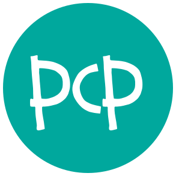

 [](https://codecov.io/gh/alekcz/pcp)

**Welcome to PCP**

> PCP: Clojure Processor -- _Like drugs but better_  

## Introduction

Too long have we hustled to deploy clojure website. Too long have we spun up one instance per site. Too long have reminisced about PHP. Today we enjoy the benefits of both. Welcome to PCP.

### Status
Experimental. Active development. Stabilizing.    

### Goals

* Any easy to use, drop-in replacement for php scripts
* Allow multiple website to be hosted on single $5 VPS

### Non-goals

* Performance.  _PCP should be sufficient for prototypes and small websites  (<= 40 req/s)_

### How PCP works
PCP has two parts the utility is simple binary, built with GraalVM, that allows you work effectively with pcp. 
```
PCP: Clojure Processor -- Like drugs but better

Usage: pcp [option] [value]

Options:
  new [project]           Create a new pcp project in the [project] directory
  service [stop/start]    Stop/start the PCP SCGI server daemon
  passphrase [project]    Set passphrase for [project]
  secret [path]           Add and encrypt secrets at . or [path]
  secret [path]           Add and encrypt secrets at . or [path]
  -e, --evaluate [path]   Evaluate a clojure file using PCP
  -s, --serve [root]      Start a local server at . or [root]
  -v, --version           Print the version string and exit
  -h, --help              Print the command line help
```      
The heavy lifting is done by an [SCGI](https://en.wikipedia.org/wiki/Simple_Common_Gateway_Interface) server. This server runs on port 9000 and receives requests from the local pcp server or from nginx. The SCGI server is an uber jar that runs as a daemon.

### Demo site

You can view a demo site built in PCP here: [https://pcp-demo.musketeers.io/](https://pcp-demo.musketeers.io/)

## Quick start
Install pcp via the installer script:
``` shellsession
$ bash -c "$(curl -sSL https://raw.githubusercontent.com/alekcz/pcp/master/install.sh)"
```

Query the SCGI server status:
``` shellsession
$ pcp service status
```

Create a new project:
``` shellsession
$ pcp new project-name
```

For convenience the pcp utility comes with a local server. This local sever behaves as your pcp site would when deployed with nginx. 

``` shellsession
$ cd project-name
$ pcp -s public/
```

You can find instructions on [replacing php here](./docs/replacing-php.md)

## Guides

1. [Installation](./docs/installation.md)
2. [PCP environment](./docs/pcp-environment.md)
3. [Environment variables and secrets](./docs/environment-variables-and-secrets.md)
4. [Replacing php](./docs/replacing-php.md)
5. [PCP demo site](https://pcp-demo.musketeers.io/)

## Project structure and requiring files

Requiring files in works in PCP as it does in Clojure.


## Core PCP functions

The following function are part of the core PCP namespace and are made available for convenience. 

### `pcp/persist`

#### `pcp/clear` 

#### `pcp/request`

#### `pcp/response`

#### `pcp/render-html`

#### `pcp/render-html-unescaped render-html-unescaped`

#### `pcp/secret` 

#### `pcp/now`

## Additional Namespaces

In addition to the core clojure namespace made available by [sci](https://github.com/borkdude/sci). The following namespaces may also be included.

  - `clojure.string`
  - `clojure.core.async` 
  - `clojure.edn`
  - `cheshire.core`
  - `selmer.parser`
  - `selmer.filters`
  - `org.httpkit.client`
  - `org.httpkit.sni-client`
  - `clj-http.client`
  - `next.jdbc`
  - `honeysql.core`
  - `honeysql.helpers`
  - `postal.core`
  - `tick.alpha.api`
  - `buddy.sign.jwt` 
  - `buddy.sign.jwe`
  - `buddy.core.hash`
  - `buddy.core.codecs`
  - `buddy.core.keys` 
  - `buddy.auth.backends`
  - `buddy.auth.middleware`
  - `buddy.hashers` 
  - `garden.core` 
  - `garden.stylesheet`
  - `garden.units` 
  - `konserve.core`
  - `konserve.filestore`
  - `konserve-jdbc.core` 
    


## Special thanks
For the guidance and examples, special thanks to

- [@BrunoBonacci](https://github.com/BrunoBonacci) 
- [@borkdude](https://github.com/borkdude) 

## License

Copyright © 2020 Alexander Oloo

PCP is licensed under the MIT License.